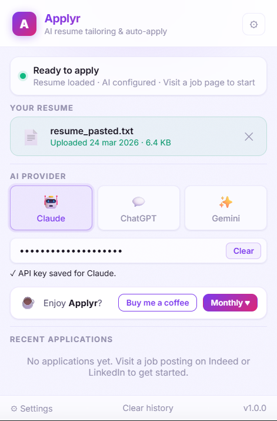
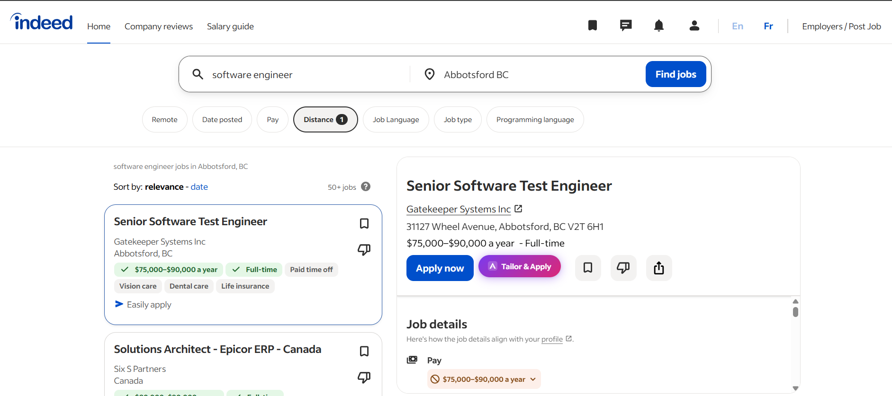
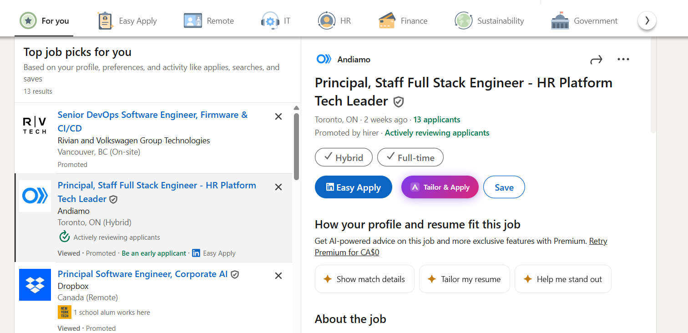
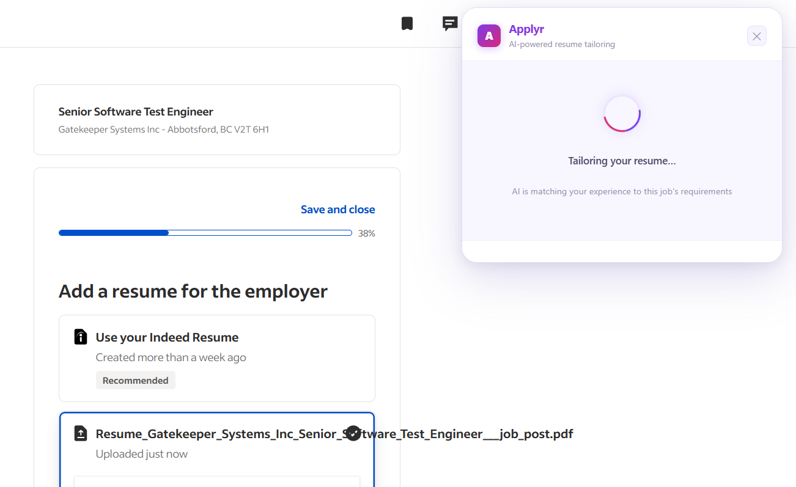
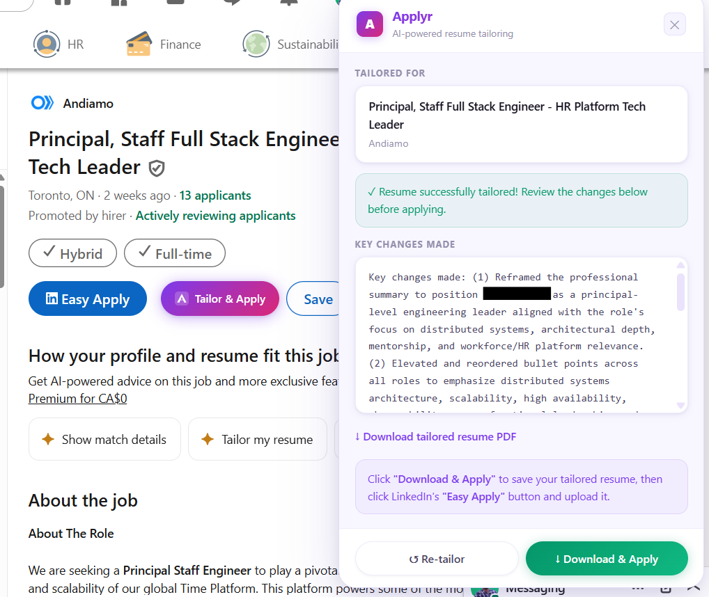
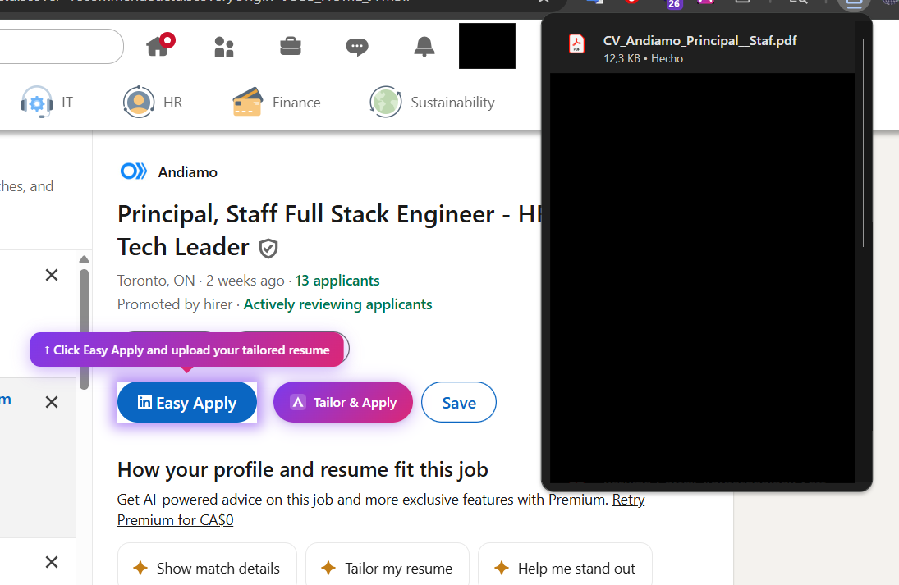
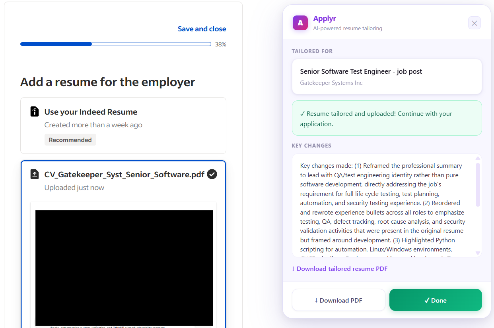

# Applyr – AI Resume Tailoring & Auto-Apply Chrome Extension

Applyr is a Chrome extension that automatically tailors your resume to match a specific job posting on **Indeed** or **LinkedIn**, then helps you apply with your customized resume.

<p align="center">
  
</p>

---

## Features

- **AI-powered tailoring** — matches your experience to the job's requirements using Claude, ChatGPT, or Gemini
- **One-click apply** — injects a "Tailor & Apply" button next to each job's Apply button
- **Resume preview** — review AI changes before submitting
- **Auto-upload** — uploads your tailored PDF resume directly into the application form
- **Application history** — keeps a log of every job you've applied to
- **Encrypted storage** — API keys are AES-256-GCM encrypted locally; nothing is sent to Applyr's servers
- **Free forever** — bring your own API key, no subscription required

---

## How It Works

### 1. Click "Tailor & Apply" on any job posting

The button appears inline with the existing Apply and Save buttons on both Indeed and LinkedIn.

| Indeed | LinkedIn |
|--------|----------|
|  |  |

### 2. AI tailors your resume in seconds

Applyr sends your resume and the job description to your chosen AI provider, which rewrites your resume to match the role.

| Tailoring in progress | Tailored result |
|-----------------------|-----------------|
|  |  |

### 3. Download & Apply

Review the key changes, download your tailored PDF, then apply with one click.

| LinkedIn — Ready to apply | Indeed — Resume uploaded |
|---------------------------|------------------------|
|  |  |

---

## Installation

### 1. Clone or download this repository

```bash
git clone https://github.com/jean0123/applyr-extension.git
```

### 2. Load the extension in Chrome

1. Open Chrome and navigate to `chrome://extensions`
2. Enable **Developer mode** (toggle in the top-right corner)
3. Click **Load unpacked**
4. Select the `applyr-extension` folder
5. The Applyr icon will appear in your toolbar

---

## Setup

### Upload Your Resume

1. Click the **Applyr icon** in your Chrome toolbar to open the popup
2. In the **"Your Resume"** section, drag & drop your PDF resume, or click to browse
3. Applyr extracts and stores the text locally

**Alternative:** Go to **Settings > Resume** and paste your resume text directly (useful if your PDF doesn't parse correctly).

### Configure Your AI Provider

1. In the popup (or **Settings > AI Configuration**), select your AI provider:
   - **Claude** (Recommended) — API key from [console.anthropic.com](https://console.anthropic.com)
   - **ChatGPT** — API key from [platform.openai.com](https://platform.openai.com)
   - **Gemini** — API key from [aistudio.google.com](https://aistudio.google.com)
2. Paste your API key into the field and click **Save**

Your API key is encrypted using AES-256-GCM and stored only in Chrome's local storage.

---

## Supported Sites

| Site | Job Detection | Auto-Upload |
|------|--------------|-------------|
| Indeed (`indeed.com`, `ca.indeed.com`) | Yes | Yes |
| LinkedIn Easy Apply | Yes | Yes |
| LinkedIn (external apply) | Yes | Download only |

---

## File Structure

```
applyr-extension/
├── manifest.json              # Chrome Extension Manifest V3
├── popup/                     # Toolbar popup UI
├── options/                   # Full settings page
├── content/                   # Content scripts (Indeed & LinkedIn)
├── background/                # Service worker & AI providers
├── lib/                       # Storage, PDF parser, PDF generator
├── assets/                    # Icons & logo
└── screenshots/               # README screenshots
```

---

## Troubleshooting

### "Tailor & Apply" button doesn't appear
- Make sure you're on a **job detail page** (not search results)
- Refresh the page and wait 2-3 seconds

### "Could not extract text from PDF"
- Some PDFs are image-based and can't be parsed without OCR
- Go to **Settings > Resume** and paste your resume text directly

### API errors (401, 403)
- Your API key is invalid or expired — generate a new one
- Claude: ensure you have credits on your Anthropic account
- OpenAI: ensure billing is set up

### Rate limit errors (429)
- Wait 30-60 seconds and try again

---

## Privacy & Security

- All data stored locally in Chrome — nothing sent to Applyr's servers
- API keys encrypted with **AES-256-GCM** via Web Crypto API
- Data flows only between your browser and your chosen AI provider
- Delete all data anytime from **Settings > Data & Privacy > Reset Everything**

---

## Support

If you find Applyr helpful, consider [buying me a coffee](https://buy.stripe.com/9B6fZh7ELag941f5Z8dIA00)!

---

## Contributing

Pull requests are welcome. For major changes, please [open an issue](https://github.com/jean0123/applyr-extension/issues) first.

## License

MIT License
